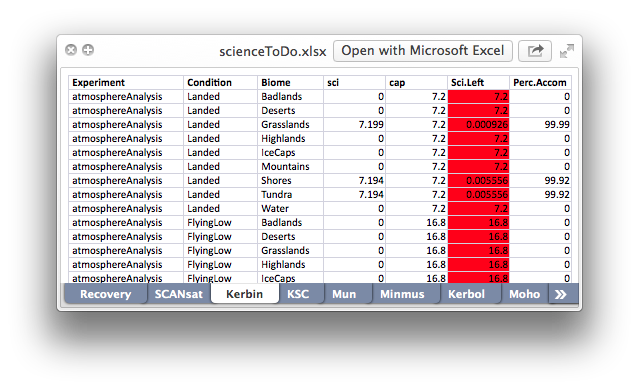

# Perl scripts to help with Kerbal Space Program

## parseScience.pl (v0.97.3)



Return a list of science points remaining and obtained so far, helpfully organized by planet/moon.  Includes KSC, vessel recovery, and asteroids!  Also supports [SCANsat](https://github.com/S-C-A-N/SCANsat).

### Requirements

- KSP (v1.0.x)
- Perl (Comes with OSX and Linux; Windows users will need [Strawberry Perl](http://strawberryperl.com/) or the like)
- Excel::Writer::XLSX, if you want your output in a spreadsheet
  - (Install via the terminal: `cpan Excel::Writer::XLSX` (recommended) or get it from [CPAN](http://search.cpan.org/~jmcnamara/Excel-Writer-XLSX-0.85/lib/Excel/Writer/XLSX.pm) or [GitHub](https://github.com/jmcnamara/excel-writer-xlsx))

### Basic Usage

````shell
perl parseScience.pl -<opts>
````

Simply run this script and an Excel file named `scienceToDo.xlsx` shoud appear.  **That's it!**  There are plenty of other options, of course.  Use `-u` to specify the username of your savefile and it will use the files found in your install; use `-g` to specify the location of your KSP folder.  Otherwise, you'll need versions of `ScienceDefs.cfg` and `persistent.sfs` in the same folder as `parseScience.pl`.  Use `-b`, `-s`, or `-p` and it will sort the output; `-a` and `-t` will give you some averages.  Use `-j` to skip all asteroid data.  If you want it to calculate SCANsat data, pass the `-i` flag.

Alternatively, use a custom config file...

### Advanced Usage

#### Config File (.parsesciencerc)

Users of this tool will almost certainly be running it repeatedly with their favorite options, so `parseScience.pl` supports a user config file to simplify things a bit.  This way, you can dump your favorite options in a file and just `path/to/parseScience.pl` without worrying about commandline options, location of the script, local files, etc.  You can still, of course, pass commandline flags to `parseScience.pl`; they will always override any settings in your config file.

The default file name is `.parsesciencerc`, found in whatever diretory you were in when you ran parseScience.pl.  Failing that, it will check the directory `parseScience.pl` is actually in.  If you're using OSX or Linux, it wil also check your `$home` directory and `~/.config/parseScience/parsesciencerc` (note the lack of a leading . in that last one).  You can at any time supply your own path via the `-f` flag.

The file itself follows strict guidelines.  You can see an example in [sample_parsesciencerc](./sample_parsesciencerc).  Each option must follow `key = value` format, one per line.  Only the following keys are available: `username` takes a savefile name and `gamelocation` is the path a KSP folder; the rest take either `true` or `false`, lowercase.  Any corresponding options provided on the commandline will override the options set here.  Should the same key be given twice, the last one will be used.

````shell
username = Zaphod
gamelocation = /Applications/KSP_osx/
average = true
tests = true
biome = true
scienceleft = true
percentdone = true
scansat = true
ignoreasteroids = true
ksckerbin = true
moredata = true
csv = true
noformat = true
excludeexcel = true
outputavgtable = true
report = true
````

Any deviations will be ignored and (hopefully) result in (gentle) notifications.

#### Full Options

The commandline options here will always override any settings in your `.parsesciencerc`; moreover, th
e negation options (-ATBSPIJKMCNEORUG) take precedence.

````shell
Usage: parseScience.pl [-atbspijkmcneor -h -f path/to/dotfile ]
       parseScience.pl [-g <game_location> -u <savefile_name>]

       parseScience.pl [-ATBSPIJKMCNEOR -G -U] -> Turn off a given option

      -a Display average science left for each planet
      -t Display average science left for each experiment type.  Supersedes -a.

      -b Sort by biome, only output data file(s).
      -s Sort by science left, including output file(s) and averages from -a
         and -t flags
      -p Sort by percent science accomplished, including output file(s) and
         averages from -a and -t flags.  Supersedes -s.

      -i Include data from SCANsat
      -j Ignore and don't consider asteroids or comets.
      -k List data from KSC biomes as being from Kerbin (same Excel worksheet)
      -m Add some largely boring data to the output (i.e., dsc, sbv, scv)
      -c Output data to csv file as well
      -n Turn off formatted printing in Excel (i.e., colors and bolding)
      -e Don't output the Excel file
      -o Save the chosen average table to a file.  Requires -a or -t.
      -r Save a matrix of per-planet test or condition data.  Require -a or -t.  Stock only.

      -g Specify path to your KSP folder
      -u Enter the username of your KSP save folder; otherwise, whatever files
         are present in the local directory will be used.
      -f Specify path to config file.  Supersedes a local .parsesciencerc file.
      -h Print this message
````

### Todo

- UPDATE:
  - Latest defs and science (`evaScience` landed or space(???63) only, magnetometer space low or high)
  - Expansion (`deployedSeismicSensor`, `deployedWeatherReport`, `deployedGooObservation`, `deployedIONCollector`, `ROCScience_*`; in SquadExpansion/Serentiy/Resources/ScienceDefs.cfg)
  - SCANsat (visual, caps are different???)
    - Maybe parse SCANsat scidefs (and expansion) via sub, so use itself (see also <https://wiki.kerbalspaceprogram.com/wiki/CFG_File_Documentation#Science_Definitions_Configuration_Files>)
  - Check data (like dV, etc.)
  - Better regex, cleanup, etc.
- Option to ignore KSC science
- ISRU science, perhaps
- More Windows/Mac/Linux-appropriate paths to Gamedata, .parsesciencerc

## deltaVScience.pl

**Roughly** estimate science point ROI as science per delta-V needed per planet/moon.  Uses [average table](./average_table.txt) output from `parseScience.pl` (-a or -as).  Scaled semi-arbitrarily.

## boundaries.pl

Print known boundary heights of conditions for each space object.

## License

Licensed under the [BSD 2-Clause license](./LICENSE).
